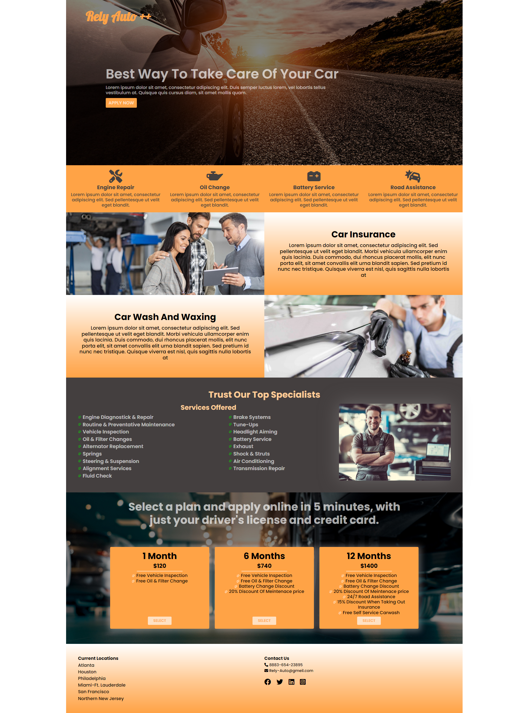

# Car Shop Landing Page

## `To Open The Project`

1.Clone Repository.

2.Open The Project In Your IDE.

3.Type in terminal:

 1. "npm install".
 2. After the previous operation is done - "npm start".

